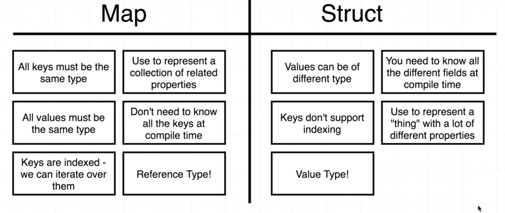

#### Reference Document
* reference : https://golang.org/pkg/

### variable and pointer
* Variable and Pointer

  * **&variable**: give me the memory address of the value this variable is pointing at
  * ***pointer**: give me the value this memory address is pointing at

  * 

* slice reference map

* valuetype vs reference type

## Map
* Map is like **hash from ruby** or **object from javascript**
#### Struct vs Map
