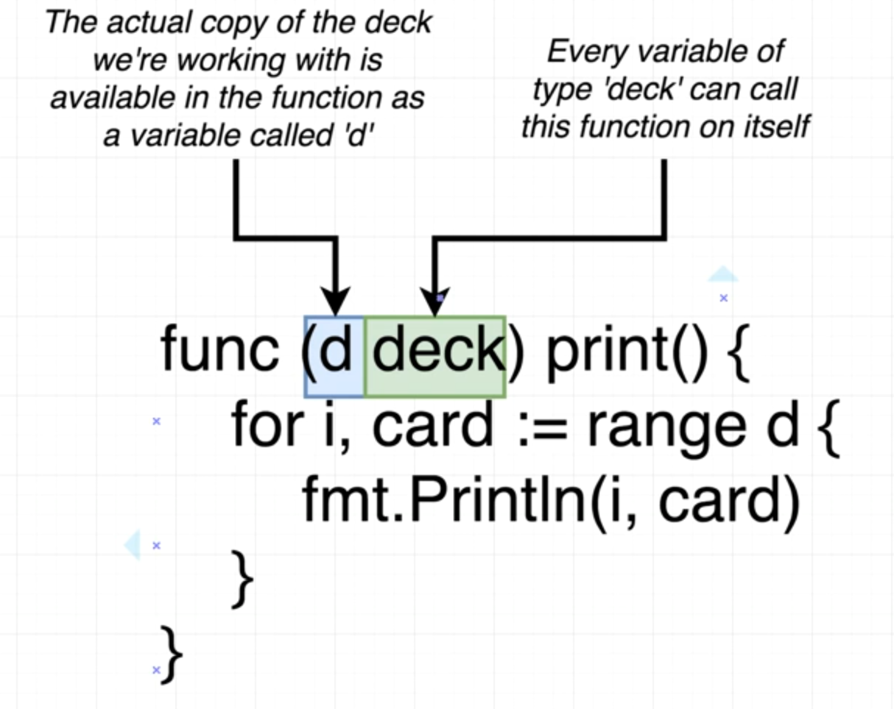

#### Reference Document
* reference : https://golang.org/pkg/


#### How to run go

```sh
go build # build but not run
go run # build go and run
```

* `package main` is important if the go project means to have a executable file to run. regardless of main package, other package name would not generate executable file when run go build, it would considered as a shared pagkage instead.

### Array vs Slice
* Array: fixed length list of things
* Slice An array that can grow or shrink

#### OO Approach of go
[example](02-cards/deck.go)


* receiver


#### Testing
```sh
# file should look like _test.go
go test
```

### variable and pointer
* Variable and Pointer

  * **&variable**: give me the memory address of the value this variable is pointing at
  * ***pointer**: give me the value this memory address is pointing at

  * 

* slice reference map


* valuetype vs reference type


## Map
* Map is like **hash from ruby** or **object from javascript**
#### Struct vs Map
c