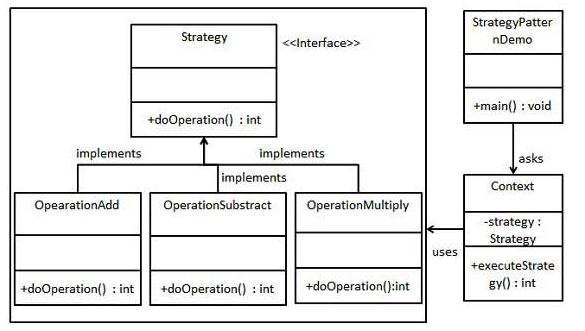
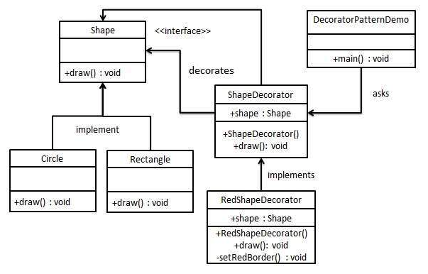
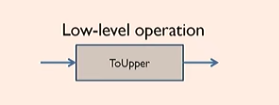
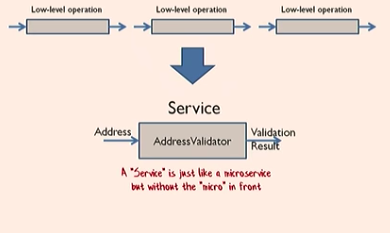
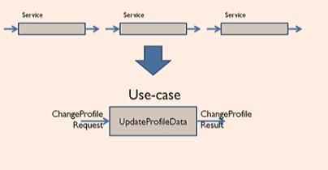
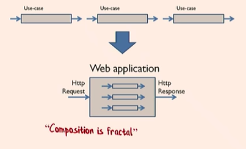
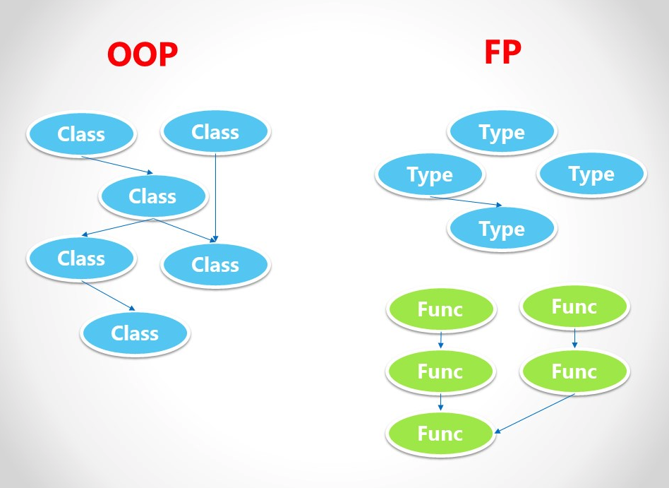
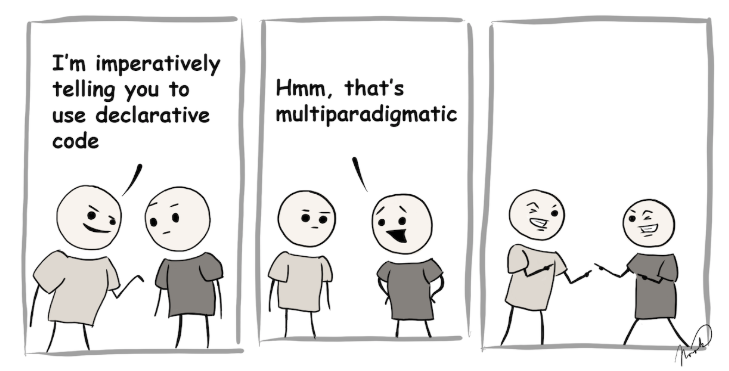

title: Functional Programming
speaker: Carmen Liu
prismTheme: okaidia
plugins:
    - echarts
    - mermaid: {theme: forest}

<slide class="bg-black-blue aligncenter" image="https://source.unsplash.com/6njoEbtarec/ .dark">

Why{.text-landing.animated.fadeInDown.delay-800}
# Functional Programming {.text-landing.text-shadow}

By Carmen Liu {.text-intro}


<slide class="aligncenter">

# Let's Start with a Code Snappit


<slide >
## Function
----

```javascript
function printOneToFive() {
  const lists = [1,2,3,4,5]
  for (i = 0; i < lists.length; i++) {
    console.log(`this is ${item}`)
  }
}

printOneToFive();
```

<slide >
## Function
----
:::column

```javascript
function printOneToFive() {
  //Hardcoded Data....
  const lists = [1,2,3,4,5]
  for (i = 0; i < lists.length; i++) {
    console.log(`this is ${item}`)
  }
}

printOneToFive();
```
----
```javascript {.tobuild.fadeInRight}
function printList(lists) {
  for (i = 0; i < lists.length; i++) {
    console.log(`this is ${item}`)
  }
}

const numbers = [1,2,3,4,5]
printList(numbers);
```

<slide >
## Function
----
:::column

```javascript
function printList(lists) {
  for (i = 0; i < lists.length; i++) {
    //hardcoded Behavior...
    console.log(`this is ${item}`)
  }
}

const numbers = [1,2,3,4,5]
printList(numbers);
```
----
```javascript {.tobuild.fadeInRight}
function each(lists, fn) {
  for (i = 0; i < lists.length; i++) {
    fn(lists[i])
  }
}

const numbers = [1,2,3,4,5]
function print(item) {
  console.log(`ths number is ${item}`)
}

each(numbers, print);
```

<slide >
## Function
----
:::column

#### Each
```javascript
function each(lists, fn) {
  for (i = 0; i < lists.length; i++) {
    fn(lists[i])
  }
}
```

----
#### Map
```javascript
function map(lists, fn) {
  const result = [];
  for (i = 0; i < lists.length; i++) {
    result.push(fn(lists[i]))
  }
  return result
}
```
----
#### Reduce
```javascript
function reduce(array, func, accumulator) {
  const index = -1,
    length = array == null ? 0 : array.length;
  if (length) {
    accumulator = array[++index];
  }
  while (++index < length) {
    accumulator = func(accumulator, array[index], index, array);
  }
  return accumulator;
}
```

:::
# High Order Function {.tobuild.fadeInRight}

<slide>
## Function is the first class citizen
----
#### Advantage ?s

:::column
* Second Class's pain{.tobuild.fadeIn}
``` {.tobuild.fadeIn}
MethodA: hey little methodB, I need your help,
         can you help me
MethodB: no, sorry, I cannot buddy, I cannot
         do anyone’s favor because
         my boss controlled my self will?
MethodA: what? What that mean?
MethodB: I only take Class B’s order?
MethodA: okey, if I need you, what should I do?
MethodB: tell you boss Class A to have a
         relationship with my Boss ClassB,
         then you can ask my boss to call me.
MethodA: okey….. let me try. Thanks buddy.
```
----
* What's that mean? {.tobuild.fadeIn}

```typescript {.tobuild.fadeIn}
class Car {
  engine: Engine;
  constructor(engine:Engine){
    this.engine = engine;
  }

  go() {
    this.engine.start();
  }
}

class Engine {
  start() {
    console.log('engine started')
  }
}

new Car(new Engine()).go()
```

<slide>
## Stratgy Pattern
----
 {.aligncenter}
<slide>

<slide>
## Stratgy Pattern
----
#### OO way
:::column

```java
public interface Strategy {
   public int doOperation(int num1, int num2);
}
```
```java
public class OperationAdd implements Strategy{
   @Override
   public int doOperation(int num1, int num2) {
      return num1 + num2;
   }
}

public class OperationSubstract implements Strategy{
   @Override
   public int doOperation(int num1, int num2) {
      return num1 - num2;
   }
}

public class OperationMultiply implements Strategy{
   @Override
   public int doOperation(int num1, int num2) {
      return num1 * num2;
   }
}

```
----
```java
public class Context {
   private Strategy strategy;

   public Context(Strategy strategy){
      this.strategy = strategy;
   }

   public int executeStrategy(int num1, int num2){
      return strategy.doOperation(num1, num2);
   }
}
```
```java
public class StrategyPatternDemo {
   public static void main(String[] args) {
      Context context = new Context(new OperationAdd());
      System.out.println("10 + 5 = " + context.executeStrategy(10, 5));

      context = new Context(new OperationSubstract());
      System.out.println("10 - 5 = " + context.executeStrategy(10, 5));

      context = new Context(new OperationMultiply());
      System.out.println("10 * 5 = " + context.executeStrategy(10, 5));
   }
//10 + 5 = 15
// 10 - 5 = 5
// 10 * 5 = 50
}
```

<slide>
## Stratgy Pattern
----
#### Functional Way
:::column
```javascript
function doOperation(data, func) {
  return func(data)
}

function add({x,y}) {
  return x + y
}

function substract({x,y}) {
  return x - y
}

function multiply({x,y}) {
  return x * y
}

```
----
```javascript
const data = {  x: 10, y: 5 }

console.log(doOperation(data, add)) //15
console.log(doOperation(data, substract)) //5
console.log(doOperation(data, multiply)) //50

```


<slide>
## Decorator Pattern
----
 {.aligncenter}

<slide>
## Decorator Pattern
----
#### OO way
:::column

```java
public interface Shape {
   void draw();
}
```
```java
public class Rectangle implements Shape {

   @Override
   public void draw() {
      System.out.println("Shape: Rectangle");
   }
}
public class Circle implements Shape {

   @Override
   public void draw() {
      System.out.println("Shape: Circle");
   }
}

```
```java
public abstract class ShapeDecorator implements Shape {
   protected Shape decoratedShape;

   public ShapeDecorator(Shape decoratedShape){
      this.decoratedShape = decoratedShape;
   }

   public void draw(){
      decoratedShape.draw();
   }
}
```
----
```java
public class RedShapeDecorator extends ShapeDecorator {

   public RedShapeDecorator(Shape decoratedShape) {
      super(decoratedShape);
   }

   @Override
   public void draw() {
      decoratedShape.draw();
      setRedBorder(decoratedShape);
   }

   private void setRedBorder(Shape decoratedShape){
      System.out.println("Border Color: Red");
   }
}
```
```java
public class DecoratorPatternDemo {
   public static void main(String[] args) {

      Shape circle = new Circle();
      Shape redCircle = new RedShapeDecorator(new Circle());
      Shape redRectangle = new RedShapeDecorator(new Rectangle());

      circle.draw(); // Shape: Circle
      redCircle.draw();
      // Shape: Circle
      // Border Color: Red
      redRectangle.draw();
      // Shape: Rectangle
      // Border Color: Red
   }
}

```

<slide>
## Decorator Pattern
----
#### Functional Way
:::column
```javascript
function draw(shape) {
  return `draw ${shape}`;
}

function drawShapeWithRedBorder(func, shape) {
  return `Border Color: Red, ${func(shape)}`;
}
```
----
```javascript
console.log(draw('Circle'));
//draw Circle
console.log(draw('Red'));
//draw Red

console.log(drawShapeWithRedBorder(draw, 'Circle'))
// Border Color: Red, draw Circle

```
<slide class="bg-blue aligncenter" video="https://webslides.tv/static/videos/working.mp4 poster='https://webslides.tv/static/images/working.jpg' .dark">

:::{.content-left}
### Functional Programming

:::flexblock {.specs}
::fa-bomb::

## Benefit 1
Less code

---
::fa-car::

## Benefit 2
Simple

---
::fa-briefcase::
## Benefit 3
Reuseability

:::

<slide class="bg-green">


## Pure Function
----
* Functions vs Procedure
:::column

```javascript
function printName(name) {
    console.log(`my mane is ${name}`)
}

printName('carmen')

```
```javascript
let name = 'carmen'
function printName() {
    return `my mane is ${name}`
}

console.log(printName())
```
----
```javascript
function printName(name) {
    return `my mane is ${name}`
}
printName('carmen')
```


<slide class="bg-green">

## Pure Function
* Relies on no external state.

----
:::column

```javascript
var y;
function f(x) {
    y = (2 * Math.pow( x, 2 )) + 3;
}
f( 2 );
y;
```

---
```javascript
function f(x) {
    return (2 * Math.pow( x, 2 )) + 3;
}
var y = f( 2 );
y;
```
* Reducing Side Effects{.tobuild}
* Easy to reason about(Read ability) {.tobuild}
----
##### Side Note: Types of side-effects {.tobuild}
``` {.tobuild}
* Global Variables
* Call impure functions
* Mutate arguments
* Use ref/out arguments
* Class variables
* Exceptions
* User interface. Dataime.now
* I/O: database, file system. http, registry, etc
```
<slide class="bg-green">

## Pure Function
----
* Given the same input, it would have the same output
    * Date is impure
    * Ramdom is impure
:::column
```javascript
function getCurrentTime() {
    return new Date().getTime();
}

const time = getCurrentTime();

time;
```
---
```javascript
function getCurrentTimeFormDate(date) {
    return date.getTime();
}

const time = getCurrentTimeFormDate(new Date());

time;
```
* Easy to predict {.tobuild}
* Easily testable, easy to debug  {.tobuild}

<slide class="bg-blue aligncenter" video="https://webslides.tv/static/videos/working.mp4 poster='https://webslides.tv/static/images/working.jpg' .dark">

:::{.content-left}
### Functional Programming

:::flexblock {.specs}
::fa-bomb::

## Benefit 4
Reducing Side Effects

---
::fa-car::

## Benefit 5
Easily testable, easy to debug

---
::fa-briefcase::
## Benefit 6
Easier to reason about (Readbility)

:::

<slide class="bg-blue">

## Value Immutability
----
```javascript
function sum(list) {
    var total = 0;
    for (let i = 0; i < list.length; i++) {
        if (!list[i]) list[i] = 0;
        total = total + list[i];
    }
    return total;
}

var nums = [ 1, 3, 9, 27, , 84 ];

sum( nums );  // 124
```

* Anything happen? {.tobuild}
  * what's the nums at the end?

```{.tobuild}
[1, 3, 9, 27, 0, 84]
```
<slide class="bg-blue">
## Value Immutability
----

```javascript
function sum(list) {
    var tempList = list.slice()
    var total = 0;
    for (let i = 0; i < tempList.length; i++) {
        if (!tempList[i]) tempList[i] = 0;
        total = total + tempList[i];
    }
    return total;
}

var nums = [ 1, 3, 9, 27, , 84 ];

sum( nums );  // 124
console.log(nums) //[ 1, 3, 9, 27, , 84 ];
```
* less bug{.tobuild}

<slide class="bg-blue">
## Value Immutability
----

:::column
```java
public class ExtrinsicLockCounter {
    private int counter = 0;
    private final Object lock = new Object();

    public void incrementCounter() {
        synchronized(lock) {
            counter += 1;
        }
    }
    // standard getter
}
```

* Thread safety{.tobuild}
---

##### Sidenote:{.tobuild}
```{.tobuild}
Disadvantage:
* Copy require:  CPU time and extra memory;
* The old values (if no longer referenced)
  are also being garbage collected.
  That's even more CPU burn.
```
<slide class="bg-blue aligncenter" video="https://webslides.tv/static/videos/working.mp4 poster='https://webslides.tv/static/images/working.jpg' .dark">

:::{.content-left}
### Functional Programming

:::flexblock {.specs}
::fa-bomb::

## Benefit 7
Less Bug

---
::fa-car::

## Benefit 8
Thread-safety, parallelism

:::


<slide class="bg-blue aligncenter" image="https://cdn-images-1.medium.com/max/2560/1*ntgBBkoEipqEHD-NpgAspg.png .light">

# Why You?

<slide class="bg-blue aligncenter" image="https://cdn-images-1.medium.com/max/2560/1*ntgBBkoEipqEHD-NpgAspg.png .light">

# Fun
---
!

<slide class="bg-blue aligncenter" image="https://cdn-images-1.medium.com/max/2560/1*ntgBBkoEipqEHD-NpgAspg.png .light">

# Fun - Compose
---
!

<slide class="bg-blue aligncenter" image="https://cdn-images-1.medium.com/max/2560/1*ntgBBkoEipqEHD-NpgAspg.png .light">

# Fun - Compose
----
:::column{.vertical-align}

!
!

----

!
!

:::


<slide class="bg-blue aligncenter" image="https://cdn-images-1.medium.com/max/2560/1*ntgBBkoEipqEHD-NpgAspg.png .light">

# 2 is better than 1
----

!

<slide class="bg-blue aligncenter" image="https://cdn-images-1.medium.com/max/2560/1*ntgBBkoEipqEHD-NpgAspg.png .light">

# 2 is better than 1
----

!


<slide class="bg-blue aligncenter" video="https://webslides.tv/static/videos/working.mp4 poster='https://webslides.tv/static/images/working.jpg' .dark">

:::{.content-left}
### Why Developer need to learn Functional Programming

:::flexblock {.specs}
::fa-bomb::

## Benefit 9
Fun

---
::fa-car::

## Benefit 10
2 is better than 1
:::

<slide>
:::card {.quote}


---
> The venerable master Qc Na was walking with his student, Anton. Hoping to prompt the master into a discussion, Anton said "Master, I have heard that objects are a very good thing - is this true?" Qc Na looked pityingly at his student and replied, "Foolish pupil - objects are merely a poor man's closures."
> Chastised, Anton took his leave from his master and returned to his cell, intent on studying closures. He carefully read the entire "Lambda: The Ultimate..." series of papers and its cousins, and implemented a small Scheme interpreter with a closure-based object system. He learned much, and looked forward to informing his master of his progress.
> On his next walk with Qc Na, Anton attempted to impress his master by saying "Master, I have diligently studied the matter, and now understand that objects are truly a poor man's closures." Qc Na responded by hitting Anton with his stick, saying "When will you learn? Closures are a poor man's object." At that moment, Anton became enlightened.
> ==Anton van Straaten 6/4/2003==

<slide>
:::card {.quote}


---
> Don't make American great again, make the world great.
> Don't make OO greate again, make software great.
> ==Aladdin==


<slide class="bg-purple" :class="size-50 aligncenter" image="http://h1.ioliu.cn/bing/SandiaSunrise_ZH-CN11155504388_1920x1080.jpg .dark">

## Thank you!

<slide>

Q&A?
when you can apply function?
* when you think of immutability
* when you think of reduce side effects
* when you start to use function as a parameter
* when you do composition
