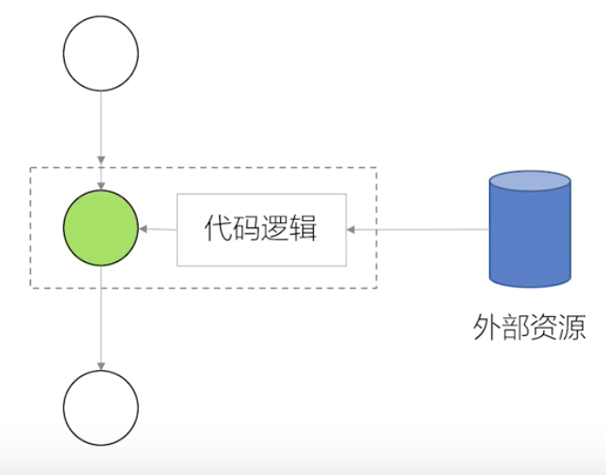

## S03 React LifeCycle

* Reference:
  * [Understanding React component life-cycle](https://code.likeagirl.io/understanding-react-component-life-cycle-49bf4b8674de)

## S06 HOC and Function as child component


#### HOC Definition
HOC is a function that takes a component and returns a new component

#### Why Higher Order Component



HOC in charge of provide extra data or functions to it wrapper component 负责为他封装的组件提供一些额外的功能或数据

As the chart described, if you relays on it parents component to passing the data, the data has been passing through all the layers of the component, even if the data is not needed in between some of the componenet. 如果父组件和子组件之间相隔很多个组件的情况下，子组件需要的数据需要父组件层层的传递，及时中间的组件不需要这些数据，也需要被传递

As you build React Application, you will run into a situations where you want to share the same functionality across multiply components.

* The wrapped component receives all the props of container, along with a new props
```javascript
return <WrapperComponent time={this.state.time} {...this.props} />
```

#### Function as child component(FaCC)(函数作为子组件)

Componenet would assumed that there will passing a function as a children component. when using this component, it would contains a Children Function, which takes a argument and returns some rendered function back. etc:

```javascript
class MyComponent extends React.Component {
  render () {
    return (
      <div>
        {this.props.children('Carmen Liu')}
      <div>
    )
  }
}
<MyComponent>
  {(name) => (
    <div> {name} </div>
  )}
</MyComponent>
```

* [Use case](./src/c06/AdvancedTabSelector.js)

##### Advantage:
How the componenet be rendered is controlled by the place where use the componenet, instead of add more functions to component it self to fit in all the situations


## 07-Context API

* [Use Case](./src/c07/LocaleSample.js)

## 10 Redux
* Trait of Redux: 
  * Single Source of Truth
  * Predictable(immutable) -> state+action = new state
  * 纯函数更新store(输出结果完全取决于输入参数)
  ```js
  const counter = (state = initialState, action) => {
    switch (action.type) {
      case 'PLUS_ONE':
        return { count: state.count + 1 }
      case 'MINUS_ONE':
        return { count: state.count - 1 }
      case 'CUSTOM_COUNT':
        return { count: state.count + action.payload.count }
      default:
        break
    }
    return state
  }
  ```

  

  * Secrete of bindActionCreator
  ```js
  function bindActionCreator(actionCreator, dispatch) {
    return function () {
      return dispatch(actionCreator.apply(this, arguments));
    };
  }
  ```

  * Usage of combineReducers
  ```js
  const store = createStore(
    combineReducers({
      todos,
      counter
    })
  )
  ```

  #### Immutability
  * Why need Immutability
    * Performance, only have to check if the reference changed instead of check if the values changes
    * Easy to Debug and track, as you have 2 state to compare, like Redux Dev Tool

* How to write Immutability data
  * {...} or Object.assign
  ```javascript
  const state = {filter: 'complate', todos: ['Learning English']}
  const newState1 = {...state, todos: [...state.todos, 'Learn Development Skills']}
  const newState2 = Object.assign({}, state, {todos:[...state.todos, 'Learn Development Skills']})
  ```
  * [immutability-helper](https://github.com/kolodny/immutability-helper)
  ```js
  import update from 'immutability-helper'
  const state = {filter: 'complate', todos: ['Learning English']}
  const newState = update(state, {todos: {:push:['Learning Development Skills']}})
  ```
  * [immer](https://github.com/mweststrate/immer)
  ```js
  import produce from 'immer'
  const state = {filter: 'complate', todos: ['Learning English']}
  const newState = produce(state, draftState => {
    draftState.todos.push('Learning Development Skills')
  })
  ```